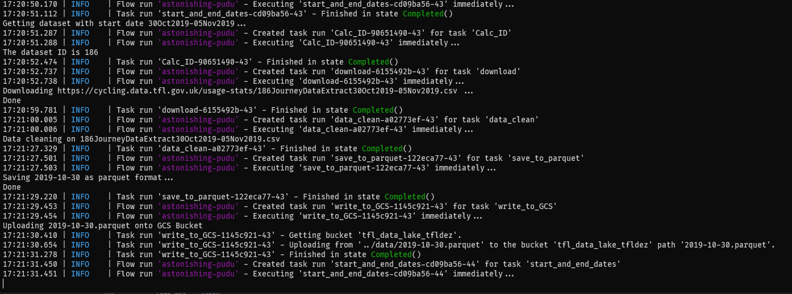
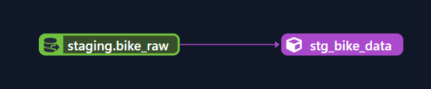
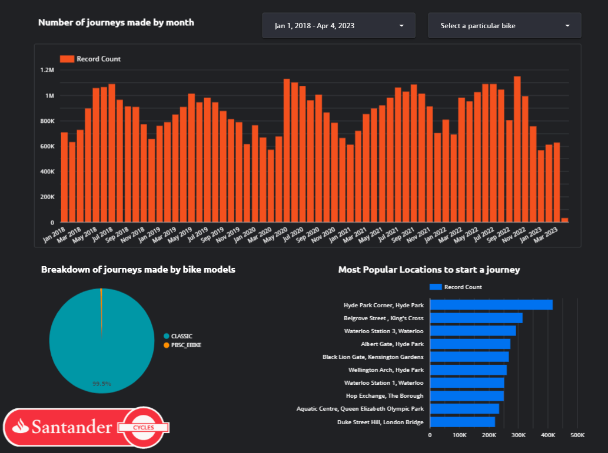
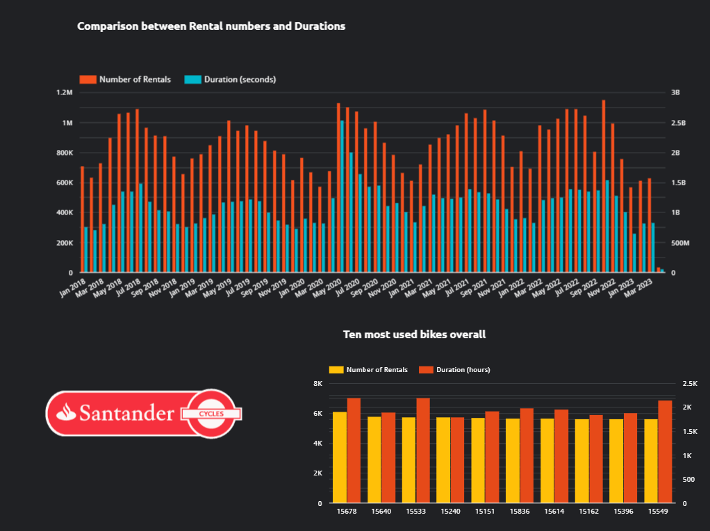
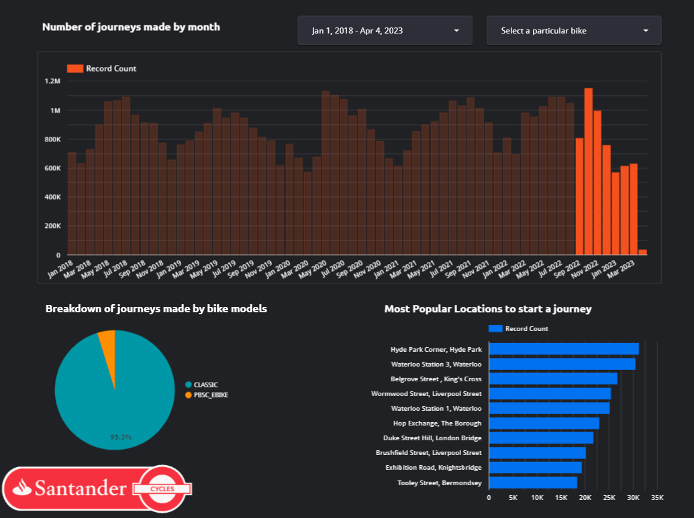

(image from [getty](https://www.gettyimages.co.uk/detail/news-photo/santander-cycles-are-parked-in-their-docking-station-in-news-photo/478094148))

# TfL Bikes Data Engineering Project
This is a Data Engineering Project which uses the publicly available [cycling data from Transport for London](https://cycling.data.tfl.gov.uk/).
TfL Bikes (formally known as Santander Cycles) is the bicycle sharing system in central London since 2010. The operation of the scheme is contracted by Transport for London to Serco. In Sep 2022 TfL introduced electric bikes which makes cycling in London more comfortable and convenient.


## Problem Statement
TfL have made available a [unified API](https://tfl.gov.uk/info-for/open-data-users/unified-api) for open data sharing. [Detailed information]((https://cycling.data.tfl.gov.uk/)) for each journey can also be retrieved for data analysis.

While TfL kindly provides a full list of data for journeys on the cycling scheme since 2012, a lack of a live and interactive dashboard means the general public are finding it difficult to understand the vast amount of data.
The purpose of this project is to make an flowing data pipeline which extracts the data from TfL portal, loads into a cloud storage platform, apply data transformation and visualise the findings.

## Technology Stack
The following services are used in this project:
- Terraform - as Infrastructure-as-Code (IaC) tool
- Prefect - as Data Orchestration tool
- Google Cloud Storage (GCS) - as Data Lake
- Google BigQuery (BQ) - as Data Warehouse for queries
- dbt - as Data Transformation and Modelling tool
- Google Looker Studio - as Data Visualisation tool

The Data Pipeline Archiecture is as followed: PIC

## Data Description
There are two sets of raw data format available on TfL portal. Since the introduction of electric bikes on 12 Sep 2022 the dataset format was also renewed. Please find the following table for reference.
| Column(after data transformation) | Raw data column (before 12 Sep 2022)| Raw data column (after 12 Sep 2022)| Description |
|--------|--------|--------|-------------|
| rental_id | Rental Id | Number | Unique identifier for each journey |
| start_date | Start Date | Start date | The date and time for start of journey |
| startstation_id | StartStation Id | Start station number | Unique ID for start location (a bike station) |
| startstation_name | StartSation Name | Start station | Name of the start location |
| end_date | End Date | End date | The date and time for end of journey |
| endstation_id | EndStation Id | End station number | Unique ID for end location (a bike station) |
| endstation_name | EndSation Name | End station | Name of the end location |
| bike_id | Bike Id | Bike number | Unique ID for the bike hired |
| bike_model | <N/A> | Bike model | The type of bike hired (Classic Manual Bike or PBSC Electric Bike)
| duration | Duration | Total duration (ms) | The total duration of the journey (in minutes after data transformation) |
| <N/A> | <N/A> | Total duration | The total duration of the jounrey in written form, removed after transformation |

## Dashboard
The interactive dashboard can be found [here](https://lookerstudio.google.com/u/0/reporting/aa0e9e98-d067-4763-b156-26f495f00bd7)

## Reproducibility
To reproduce the project in your working space, please follow the instructions
1. Fork this repo and clone it to your local machine
For HTTPS:
`git clone https://github.com/leocmcheung/tfldez.git`
For SSH:
`git clone git@github.com:leocmcheung/tfldez.git`

2. Setup your Google Cloud
- Create a Google account and signup for [Google Cloud Platform](https://console.cloud.google.com/)
- Create a New Project and take note of the project-id
- Create a Service Account and configure its Identity and Access Management (IAM) policy
  - Viewer
  - Storage Admin
  - Storage Object Admin
  - BigQuery Admin
- Create a new key for the service account, and download the key as JSON credentials. Store the key in a secure location.
- Install the [Google Cloud SDK](https://cloud.google.com/sdk/docs/install-sdk)
- Replace the GCP key location in the following codes and execute the codes on terminal:
```export GOOGLE_APPLICATION_CREDENTIALS=<path_to_your_credentials>.json
gcloud auth activate-service-account --key-file $GOOGLE_APPLICATION_CREDENTIALS
gcloud auth application-default login
```
- Close and restart your terminal

3. (Optional) Create a new virtual environment. The following codes are for creating a new virtualenv using pyenv, although other environment applications are available (e.g. Anaconda). In the project directory run:
```
pyenv install 3.10.6
pyenv virtualenv 3.10.6 tfldez
pyenv local tfldez
```

4. Data Infrastructure
- Follow the [instructions](https://developer.hashicorp.com/terraform/downloads) on the website for your particular operating system and install Terraform.
- Once installed go to `terraform/` folder and update your GCP project's region and zone (default as europe-west6 Zurich)
- Run the following codes on terminal to initiate, plan and apply the infrastructure.
```bash
cd terraform/
terraform init
terraform plan -var="project=<your-gcp-project-id>"
terraform apply -var="project=<your-gcp-project-id>"
```

5. Data Orchestration
- Sign up for [Prefect Cloud](https://app.prefect.cloud/auth/login) if you do not have an account
- Create a new workspace
- Go to `flows/prefectblocks_init.py` and update your GCP credentials and the GCS bucket name. Remember do not share your GCP credentials on any public repositories!!!
- Run the following commands on terminal:
```
cd flows/
python prefectblocks_init.py
```
- Run the following command to start the flow:
```
prefect agent start -q 'default'
```
- Open a new terminal instance and run the data ingestion command. It will start data ingestion from Jan 2018 to Mar 2023, creating and uploading 274 weekly parquet files.
```
python ingest.py
```

- Depending on your internet connection it should take about 1 minute to download, process and upload each weekly dataset, thus 3-4 hours for all processes to run. For a shorter time range please finetune your dates in `ingest.py`

6. Data Transformation and Modelling
- In Google BigQuery run the following script:
```
CREATE OR REPLACE EXTERNAL TABLE tfl_data.bike_raw
OPTIONS (
  format = 'parquet',
  uris = ['gs://tfl_data_lake_tfldez/*.parquet']
);
```
- On terminal run the following commands:
```
cd ..
dbt build --var 'is_test_run: false'
```
dbt Lineage

- Four tables should be created in BigQuery:
  - `fact_bike_model`: Querying the journeys based on the type of bikes used
  - `fact_most_bike`: Selecting the most used bikes throughout the period
  - `fact_popular_location`: Filtering the most popular starting stations
  - `stg_bike_data`: the whole collection of transformed data stored in data warehouse

7. Data Visualisation
- Create a report on [Google Looker Studio](https://lookerstudio.google.com/), connect BigQuery to the report and select the tables starting with `'fact_ ...` to visualise the data. Have fun!



## Initial Data Analysis
- The number of rental journeys has been rising gradually from 2018 to 2023. There wasn't a significant drop in rental numbers during the COVID lockdown; instead the total duration of bikes being rented reached a maximum of 2.5 billion secconds (694 thousand hours or 79 calendar years) during the month of May 2020.
- Since the implementation of [500 electric bikes](https://madeby.tfl.gov.uk/2022/11/25/all-about-santander-cycles-e-bikes/) in Sep 2022, electric bike journeys accounted for about 5% of all journeys. There was not a rise in electric bike usage, which is expected as no new electric bikes were introduced since then.

- The overall top 10 locations to start a bike journey are either parks (Hyde Park, Olympic Park) or transport hubs (King's Cross, London Bridge).
