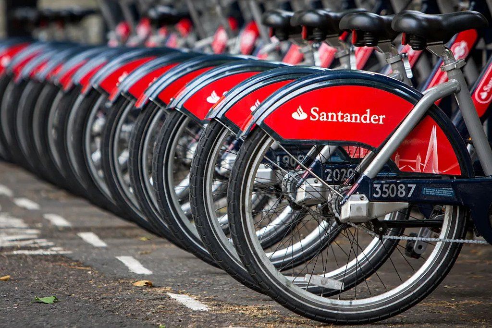

# TfL Bikes Data Engineering Project
This is a Data Engineering Project which uses the publicly available [cycling data from Transport for London](https://cycling.data.tfl.gov.uk/).
TfL Bikes (formally known as Santander Cycles) is the bicycle sharing system in central London since 2010. The operation of the scheme is contracted by Transport for London to Serco. In Sep 2022 TfL introduced electric bikes which makes cycling in London more comfortable and convenient.

## Problem Statement
TfL have made available a [unified API](https://tfl.gov.uk/info-for/open-data-users/unified-api) for open data sharing. [Detailed information]((https://cycling.data.tfl.gov.uk/)) for each journey can also be retrieved for data analysis.

While TfL kindly provides a full list of data for journeys on the cycling scheme since 2012, a lack of a live and interactive dashboard means the general public are finding it difficult to understand the vast amount of data.
The purpose of this project is to make an flowing data pipeline which extracts the data from TfL portal, loads into a cloud storage platform, apply data transformation and visualise the findings.

## Technology Stack
The following services are used in this project:
- Terraform - as Infrastructure-as-Code (IaC) tool
- Prefect - as Data Orchestration tool
- Google Cloud Storage (GCS) - as Data Lake
- Google BigQuery (BQ) - as Data Warehouse for queries
- dbt - as Data Transformation and Modelling tool
- Google Looker Studio - as Data Visualisation tool

The Data Pipeline Archiecture is as followed: PIC

## Raw Data Description
There are two sets of raw data format available on TfL portal. Since the introduction of electric bikes on 12 Sep 2022 the dataset format was also renewed. Please find the following table for reference.
| Column(after | Raw data column | Raw data column | Description |
| data transformation) | (before 12 Sep 2022) | (after 12 Sep 2022) | |
|--------|--------|--------|-------------|
| rental_id | Rental Id | Number | Unique identifier for each journey |
| start_date | Start Date | Start date | The date and time for start of journey |
| startstation_id | StartStation Id | Start station number | Unique ID for start location (a bike station) |
| startstation_name | StartSation Name | Start station | Name of the start location |
| end_date | End Date | End date | The date and time for end of journey |
| endstation_id | EndStation Id | End station number | Unique ID for end location (a bike station) |
| endstation_name | EndSation Name | End station | Name of the end location |
| bike_id | Bike Id | Bike number | Unique ID for the bike hired |
| bike_model | <N/A> | Bike model | The type of bike hired (Classic Manual Bike or PBSC Electric Bike)
| duration | Duration | Total duration (ms) | The total duration of the journey (in minutes after data transformation) |
| <N/A> | <N/A> | Total duration | The total duration of the jounrey in written form, removed after transformation |
